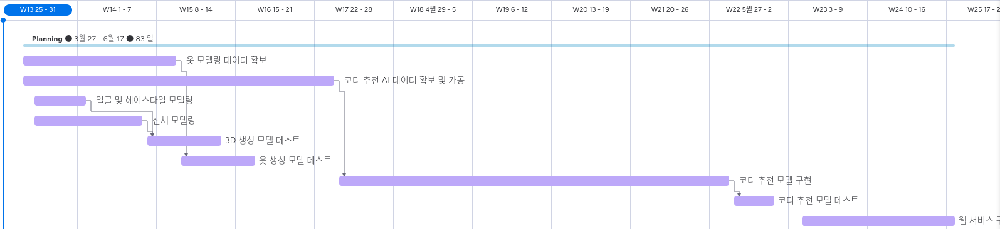

## 3-3주차 회의록

### Index

1. [서비스 내용 구체화](#서비스-내용-구체화)
2. [구현 방식](#ai)
3. [일정](#일정)
4. [역할 분담](#)

---

### 서비스 내용 구체화

1. 3D 아바타 모델링

   1. 얼굴 및 헤어스타일
      - 기존의 얼굴인식 처럼 화면에 틀을 보여주고 해당 틀에 얼굴이 들어오면 해당 이미지를 이용하여 3D 모델링
   2. 신체
      - 카메라 이용하여 앞, 옆 모습 촬영 후 신체 스펙 입력
      - 또는 수치 측정 없이 앞, 옆 모습으로 3D 모델링

   - 3D 모델 생성 : GLTF/FBX 형식의 파일로 생성

2. 옷 모델링

   - image-to-3D AI를 이용하여 생성

3. 코디 추천
   - 얼굴형과 퍼스널 컬러, 체형에 맞는 스타일 고려
   - 당일 날씨 등을 고려
   - 사용자 취향에 따른 스타일 카테고리 설정

#### 추가 구현 목표

- 웹으로 서비스

---

### AI

1. [image-to-3D 모델(openLRM)](https://github.com/VAST-AI-Research/TripoSR)을 이용하여 얼굴, 신체, 옷 사진을 3D 모델링

   - 신체를 구현하기 위해 다른 모델을 사용하거나 input data 차원을 수정해야 할 경우가 생길 수 있음
   - 신체의 상, 하체 비율은 사용자가 슬라이더로 조정할 수 있게 설정

2. 코디 추천 AI

   - Decision Tree를 이용하여 날씨, 취향에 따라 스타일 추천
   - [Recommendation Engine(Auto Encoder)](https://github.com/NVIDIA/DeepRecommender) 공부
   - VAE, [DCGAN](https://bo-10000.tistory.com/116) 사용하여 사용자에 어울리는 옷 생성

   |                                                                           <b>DCGAN</b>                                                                           |
   | :--------------------------------------------------------------------------------------------------------------------------------------------------------------: |
   |  |

3. 학습을 위한 AI
   - 코디 추천 AI 제작 시 학습을 위한 input data에서 날씨별로 추천할 수 있도록 image에서 날씨를 추출하여 분류하는 분류모델 제작
   - 3D 모델링을 위한 더 많은 옷 이미지를 가져오기 위해 편집샵에서 크롤링 할 경우 input data에 맞게 image 가공하는 AI 제작

#### 추가 구현사항

- 대화형으로 구현
- 신발, 모자 등의 악세서리 추천
- 옷 클릭 or 터치시 해당 이미지와 비슷한 옷이 있는 마켓으로 이동

---

### [일정](https://eogud1116s-team.monday.com/boards/1855304725/views/39101386)

|      <b>Planner<b/>      |
| :----------------------: |
|  |
