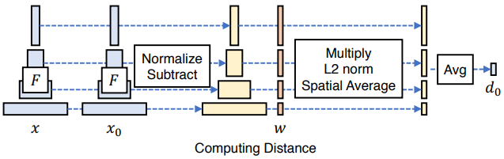

## 5주차 회의록

### 할 일

1. 진행상황 -> 보고서로 작성
    - 입력 데이터 수정 방법
    - 모델 튜닝 방법
2. [모델 평가방법 및 평가 항목](#모델-평가방법-및-평가-항목)
3. attention부터 transformer 까지 공부해오기

---

### 모델 평가방법 및 평가 항목

#### PSNR (Peak Signal-to-Noise Ratio)

영상화질 손실량을 측정하는 지표.
:heavy_exclamation_mark: 무손실 영상의 경우 MSE가 0이 되기 때문에 PSNR을 정의할 수 없다.
- MSE(Mean Square Error) : 영상 처리 분야에서 CNN Feature값들을 비교하는데 많이 사용되는 방법 중 하나

$$ MSE = \frac{1}{M * N} \sum_{M,N} [I_1(m, n) - I_2(m, n)]^2$$

$$ PSNR = 10 \cdot \log_{10} \left( \frac{MAX_I^2}{MSE} \right) $$

> MSE : MxN 영상의 픽셀간 차이의 제곱의 평균
> $MAX_I$ : 픽셀값의 최대값

#### SSIM (Structural Similarity Index Map)
인간의 시각적 품질 평가를 위한 지표
:heavy_exclamation_mark: 이미지 특정영역이 평균 RGB값으로 채워진다면, SSIM이 높을 수 있다.
:heavy_exclamation_mark: 블러처리가 되면, SSIM이 높을 수 있다. &rarr; 선명도를 평가 할 수 없다.

$$SSIM(x, y) = [l(x, y)]^\alpha \cdot [c(x, y)]^\beta \cdot [s(x, y)]^\gamma$$

$$l(x, y) = \frac{2\mu_x\mu_y + C_1}{\mu_x^2 + \mu_y^2 + C_1},\ c(x, y) = \frac{2\sigma_x\sigma_y + C_2}{\sigma_x^2 + \sigma_y^2 + C_2},\ s(x, y) = \frac{\sigma_{xy} + C_3}{\sigma_x\sigma_y + C_3}$$

$$\mu_x = \frac{1}{M \cdot N} \sum_{i=1}^{M} \sum_{j=1}^{N} x(i, j),\ \mu_y = \frac{1}{M \cdot N} \sum_{i=1}^{M} \sum_{j=1}^{N} y(i, j)$$

$$\sigma_x^2 = \frac{1}{M \cdot N} \sum_{i=1}^{M} \sum_{j=1}^{N} [x(i, j) - \mu_x]^2,\ \sigma_y^2 = \frac{1}{M \cdot N} \sum_{i=1}^{M} \sum_{j=1}^{N} [y(i, j) - \mu_y]^2$$

$$\sigma_{xy} = \frac{1}{M \cdot N} \sum_{i=1}^{M} \sum_{j=1}^{N} [x(i, j) - \mu_x][y(i, j) - \mu_y]$$

> $l(x, y)$ : 밝기 유사도, $c(x, y)$ : 콘트라스트 유사도, $s(x, y)$ : 구조 유사도
> $\mu_x, \mu_y$ : x, y의 평균, $\sigma_x, \sigma_y$ : x, y의 분산, $\sigma_{xy}$ : x, y의 공분산
> $C_1$ : 밝기 유사도 상수, $C_2$ : 콘트라스트 유사도 상수, $C_3$ : 구조 유사도 상수
> $C_1 = (0.01*L)^2, C_2 = (0.03*L)^2, C_3 = C_2/2$
> L : 픽셀값의 최대값 (흑백 : 255, RGB : 2553, RGBA : 2554)

#### LPIPS (Learned Perceptual Image Patch Similarity)
두 이미지 간의 차이를 측정하는 지표

$$ LPIPS(x, x_0) = \sum_{l} \frac{1}{H_l \cdot W_l} \sum_{h, w} \left\| w^l \odot (\hat{y}^l_{hw} - \hat{y}^l_{0hw}) \right\|_2^2 $$

> 두 이미지 $x$, $x_0$가 주어졌을때, 각각 ImageNet으로 pretrained된 Network(VGG)에 넣고,
> 중간 L개의 layer에서 activation map을 각각 뽑아내서, channel dimension으로 unit-normalize한다.
> channel-wise vector $w^l$로 scaling한 다음 채널 단위로 L2 distance를 구한다.
> 마지막으로 spatially하게 평균을 내주고 L개의 channel에 대해 channel wise로 합해준다.
>
> |<b>LPIPS</b>|
> |:---:|
> |  |
>
> $\hat{y}^l_{hw}$, $\hat{y}^l_{0hw}$ : channel dimension으로 unit-normalized된 activation map
> $w^l$ : channel-wise scaling factor
> L2 Norm : 서로 다른 두 벡터 사이의 유클리드 거리, L2 Loss : 실제값과 예측값 사이의 오차 제곱 합

#### [CD (Chamfer Distance)](https://github.com/UM-ARM-Lab/Chamfer-Distance-API)
서로 다른 point cloud 간의 거리를 측정하는 평가지표

$$CD(P, Q) = \frac{1}{|P|} \sum_{p \in P} \min_{q \in Q} \|p - q\|_2^2 + \frac{1}{|Q|} \sum_{q \in Q} \min_{p \in P} \|p - q\|_2^2$$

> $P$, $Q$ : 두 point cloud
> $p$, $q$ : 각각의 point

#### IoU (Intersection over Union)
두 영역의 겹치는 부분을 측정하는 평가지표

$$IoU = \frac{A \cap B}{A \cup B} = \frac{Area\ of\ Intersection}{A + B - Area\ of\ Intersection}$$

> Area of Intersection : 두 영역의 교집합

---

### 입력 데이터 수정 방법

-   2D 이미지 모으고, 3D 파일 모으고, label 모으고
-   각각의 이미지는 얼굴,신체,옷 폴더로 나눠서 모으면 끝

### 모델 튜닝 방법

-   허깅페이스에서 불러와서 앞 모습 파인튜닝 하고 옆모습 파인튜닝해서 2개 합치기 &rarr; 공부 필요

-   체크포인트에다가 레이어 추가 가능한지

-   처음부터 끝까지 다시 짜기

---

### 보고서 작성할 것들

-   연구 배경

-   목표 및 연구 내용

-   연구 방법

-   예상 소요 인력, 연구 비용

-   참고 문헌

-   설계 구성 요소 및 제약 요소
