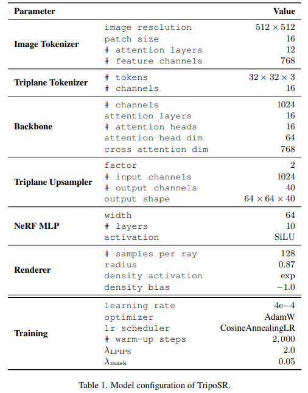
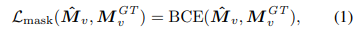
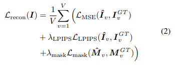
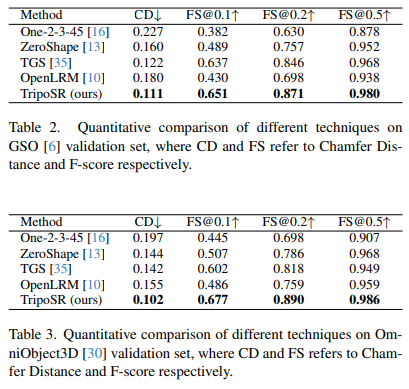
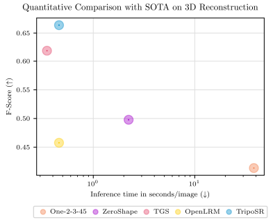

## Abstract
LRM 기반. 데이터 처리, 모델 설계 및 훈련 기법 측면에서 상당한 개선.

## Introduction

몇몇 시점의 이미지로 3D 모델을 재구성하는(3D reconstruction) AI와 3D 생성(3D generation) AI 모델의 경계가 희미해졌다. 

**3D 훈련 데이터의 부족을 극복하기 위해 최근 연구에서는 2D 확산 모델을 활용하여 텍스트 프롬프트나 입력 이미지로부터 3D 에셋을 생성하는 방법을 탐구** 

[DreamFusion](https://arxiv.org/pdf/2209.14988.pdf)의 2D diffusion을 이용한 3D 생성은 세부적인 3D 객체를 생성하는 획기적인 성과를 달성한 전략. 하지만 광범위한 최적화 및 계산 요구 사항 너무 많은 연산으로 느린 생성 속도에 문제가 있고, 출력 결과 제어의 어려움이 있다. 

feed-forward 3D reconstruction models이 상당히 높은 연산 효율성을 달성했다. 해당 방식에 따른 최근의 여러 접근 방식은 다양한 3D 데이터 세트에 대한 확장 가능한 교육의 가능성을 보여주었다. 

[TripSR](https://arxiv.org/abs/2403.02151)은 [LRM](https://arxiv.org/abs/2311.04400) 기반인데 data curation(연구 데이터 유지에 필요한 관리 활동 &larr; 뭔뜻인데;;)과 렌더링, 모델 디자인, training 기법 측면에서 상당한 개선을 이루었다.

### SDS
DreamFusion - 3D 모델의 최적화를 안내하기 위해 2D 확산 모델을 사용하여 점수 증류 샘플링(SDS)을 도입.
[SDS blog](https://xoft.tistory.com/53)

## TripoSR
### Model Overview
single RGB image as input and outputs a 3D representation of the object in the image.  
TripSR 주요 요소: an image encoder, an image-to-triplane decoder, and a triplane-based neural radiance field (NeRF)

#### The image encoder 
initialized with a pre-trained vision transformer model, DINOv1([DINOv1 github](https://github.com/facebookresearch/dino), [Emerging Properties in Self-Supervised Vision Transformers](https://arxiv.org/abs/2104.14294), [&larr; 논문 리뷰 블로그](https://kimjy99.github.io/%EB%85%BC%EB%AC%B8%EB%A6%AC%EB%B7%B0/dino/)) : RGB image into a set of latent vectors &larr; encode
the global and local features of the image and include the necessary information to reconstruct the 3D object.
#### The image-to-triplane decoder
latent vectors 를 triplane-NeRF representation으로 변환([Efficient Geometry-aware 3D Generative Adversarial Networks](https://arxiv.org/abs/2112.07945), [&larr; 해석한 블로그](https://yechan821.tistory.com/19)).
<dl>
    <dt>Triplane-NeRF representation</dt>
    <dd>컴팩트하고 표현력이 뛰어난 3D representation. 복잡한 모양과 질감을 가진 물체를 표현하는 데 적합.</dd>
    <dt>Decoder</dt>
    <dd>a stack of transformer layers, each with a self-attention layer and a cross-attention layer 로 구성됨.</dd>
    <dt>The self-attention layer</dt>
    <dd>
        디코더가 different parts of the triplane representation 의 상관관계를 학습할 수 있도록 도움을 줌.
        (allows the decoder to attend to different parts of the triplane representation and learn relationships between them).
    </dd>
    <dt>The cross-attention layer</dt>
    <dd>
        디코더가 이미지 인코더의 latent vectors에 주의를 기울여 전역 및 지역 이미지 특징을 triplane representation에 통합할 수 있도록 도움을 줌.
        (allows the decoder to attend to the latent vectors from the image encoder and incorporate global and local image features into the triplane representation).
    </dd>
    <dt>NeRF model</dt>
    <dd>consists of a stack of multilayer perceptrons (MLPs). 공간상의 3D point의 밀도와 색 예측</dd>
</dl>
conditioning the image-to-triplane projection on camera parameters 대신에 모델이 훈련 및 추론 중에 카메라 매개변수를 "추측"하도록 함. 이는 추론할때 모델이 input wild한 input image에 강점을 가짐. 
이는 정확한 카메라 정보 없이도 광범위한 실제 시나리오를 처리할 수 있는 보다 적응력 있고 탄력적인 모델을 개발하는 것을 목표.  

### Data Improvement
#### Data Curation
[Objaverse dataset](https://objaverse.allenai.org/)에서 curated 된 하위 셋 선택해서, trainig data 퀄리티 향상.(CC-BY license)

#### Data Rendering
우리는 실제 이미지의 분포를 보다 밀접하게 에뮬레이션하는 다양한 데이터 렌더링 기술을 채택하여 Objaverse 데이터 세트로만 학습한 경우에도 모델의 일반화 능력을 향상시켰습니다.

### Model and Training Improvements
#### Triplane Channel Optimization
The configuration of channels within the triplane-NeRF representation 이 훈련 및 추론 중 GPU 메모리 사용량을 관리하는 데 중요한 역할을 합니다. 이는 볼륨 렌더링의 높은 계산 비용 때문. 
채널 수는 모델의 상세하고 높은 신뢰도의 재구성 능력에도 큰 영향을 미칩니다. 
재구성 품질과 계산 효율성 간의 최적의 균형을 찾기 위해 실험 평가 끝에 40개 채널 구성을 채택. 
이 구성을 통해 훈련 단계에서 더 큰 배치 크기와 높은 해상도를 사용할 수 있고, 동시에 추론 시 메모리 요구 사항을 최소화할 수 있습니다.
#### Mask Loss
훈련 중에 Mask Loss 함수를 도입하여 "floater" 아티팩트를 상당히 줄이고 재구성의 신뢰성을 높였습니다.

> $\hat{M}_v$: $v$번째 supervision view에 대한 렌더링된 마스크 이미지
> $M_v^{GT}$: $v$번째 supervision view에 대한 ground truth 마스크 이미지
> $BCE()$: binary cross-entropy loss
> supervision view : 3D 모델을 렌더링하여 감독(supervision)에 사용되는 시점(view)
> ground truth 이미지 : 실제 실물 객체나 장면을 촬영하여 얻은 이미지를 말합니다. 즉, 3D 복원 모델이 궁극적으로 재현하고자 하는 참값 이미지를 의미합니다.

> $V$ : 모든 supervision view의 수
> $\mathcal{L}_{MSE}$: mean squared error loss
> $\hat{I}_v$ : $v$번째 supervision view에 대한 렌더링된 3D 모델의 RGB 이미지.
> $I_v^{GT}$ : $v$번째 supervision view에 대한 실제 그라운드 트루스 3D 모델의 RGB 이미지.
> $\lambda_{LPIPS}$, $\lambda_{mask}$ : 각 손실항의 가중치
> $\mathcal{L}_{LPIPS}()$: LPIPS 퍼셉션 손실
> $\mathcal{L}_{mask}()$: 마스크 손실 함수. 렌더링 마스크와 ground truth 마스크 간의 BCE 손실

Supervision view란 3D 모델을 렌더링하여 그에 대한 감독(supervision) 신호로 사용되는 특정 시점(view)을 의미합니다.
3D 복원 모델을 훈련할 때, 실제 3D 객체 또는 장면의 다양한 각도에서 촬영된 2D 이미지 집합이 주어집니다. 이 이미지들이 바로 그라운드 트루스(ground truth) 이미지입니다.
모델은 입력 이미지로부터 3D 표현을 예측합니다. 그리고 이 예측된 3D 표현을 그라운드 트루스 이미지와 동일한 시점에서 렌더링하여 이미지를 생성합니다.
이렇게 생성된 이미지와 그라운드 트루스 이미지를 비교하여 손실을 계산하고, 이 손실을 역전파하여 모델의 가중치를 업데이트합니다.
각 그라운드 트루스 이미지에 대응되는 이러한 시점을 supervision view라고 부릅니다. 모델은 다수의 supervision view에서 렌더링된 이미지와 그라운드 트루스를 비교하여 학습됩니다.

#### Local Rendering Supervision
TripoSR 모델은 supervision시에 rendering losses에만 전적으로 의존하므로, 상세한 형상과 텍스처 재구성 학습을 위해서는 high-resolution rendering이 필요합니다.
그러나 고해상도(예: 512x512 이상)로 rendering and supervising 시에 계산 및 GPU 메모리 부하가 크게 증가합니다.
이를 해결하기 위해 훈련 중에는 원본 512x512 해상도 이미지에서 128x128 크기의 random patches를 렌더링합니다.
전경 영역을 덮는 패치를 선택할 가능성을 높여 관심 영역에 더 중점을 둘 수 있습니다.
이 importance sampling 전략을 통해 객체 표면 세부 묘사의 신뢰도를 높일 수 있으며, 동시에 계산 효율성과 재구성 세밀도 사이의 균형을 맞출 수 있습니다.

## Results
### Evaluation Datasets
- GSO : Google scanned objects: A highquality dataset of 3d scanned household items.
- [OminiObject3D](https://omniobject3d.github.io/) : 중국꺼 같음

이 데이터셋들에는 단순한 형태(예: 상자, 구체, 원통)의 객체가 많이 포함되어 있어, 이런 간단한 모양에 대한 높은 검증 편향이 발생할 수 있음. 이러한 편향을 방지하기 위해 수동으로 데이터셋을 필터링하여 각 데이터셋에서 약 300개의 객체를 선별. 선별된 객체들은 다양하고 일반적인 객체들로 구성되어 있어 대표성을 가집니다.

### 3D Shape Metrics
implicit 3D representations(NeRF같은 거)를 meshes로 변환하기 위해 [Marching Cubes](https://dl.acm.org/doi/10.1145/37402.37422)로 isosurface(등고면) 추출.[&larr; 설명 블로그](https://xoft.tistory.com/47)
isosurfaces 에서 10K 점을 샘플링하여 Chamfer Distance(CD)와 F-score(FS)를 계산합니다.
일부 방법은 view centric shapes([NeRF 설명 블로그(view-centric)](https://xoft.tistory.com/25)) 예측이 불가능하므로, predictions와 ground truth shapes 간 정렬을 위해 brute-force search([완전 탐색(brute-force search) 알고리즘 설명](https://blog.naver.com/kks227/220769870195))를 사용.
최저 CD를 찾기 위해 optimizing하여 회전 각도(rotation angle)를 선형으로 검색하고 ICP(Iterative Closest Point) 방법을 사용하여 정렬을 개선.

### Quantitative Comparisons
TripoSR 모델의 성능을 피드포워드 기술을 사용하는 기존의 SOTA(STATE-OF-THE-ART) 기준선들과 비교
[One-2-3-45](https://arxiv.org/abs/2306.16928), [TriplaneGaussian (TGS)](https://arxiv.org/abs/2312.09147), [ZeroShape](https://arxiv.org/abs/2312.14198), [OpenLRM](https://github.com/3DTopia/OpenLRM) 

### Runtime
TripoSR은 NVIDIA A100 GPU에서 단일 이미지로부터 약 0.5초 만에 3D 메쉬를 생성할 수 있습니다.

## Conclusion
LRM 네트워크를 기반으로 개발된 트랜스포머 기반 아키텍처를 중심으로,
여러 축을 따라 상당한 기술적 개선하였다.(together with substantial technical improvements along multiple axes.)